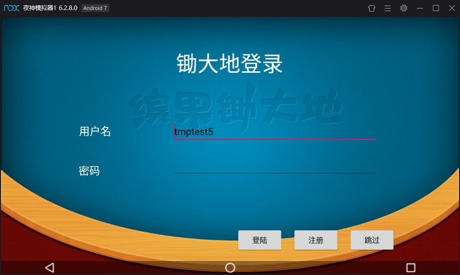
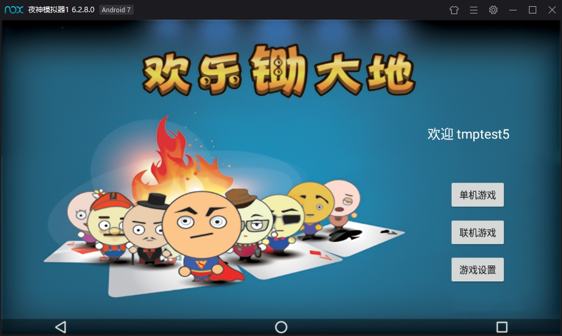
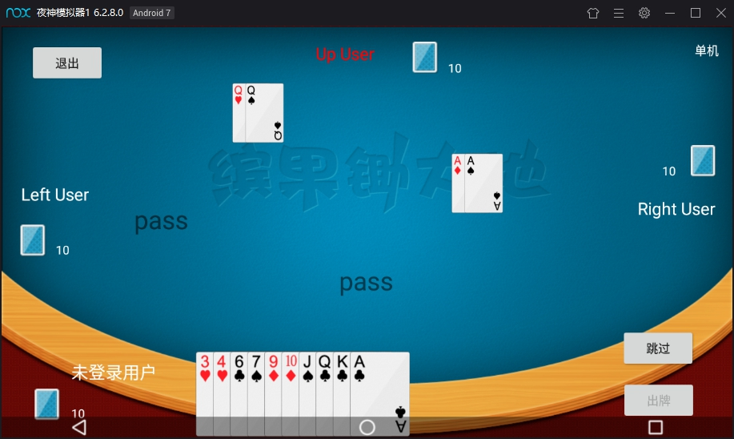
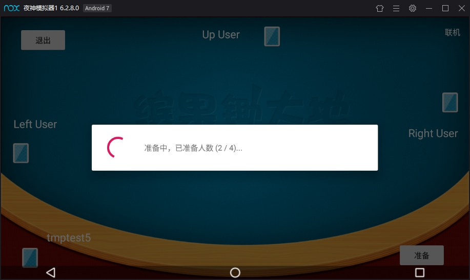
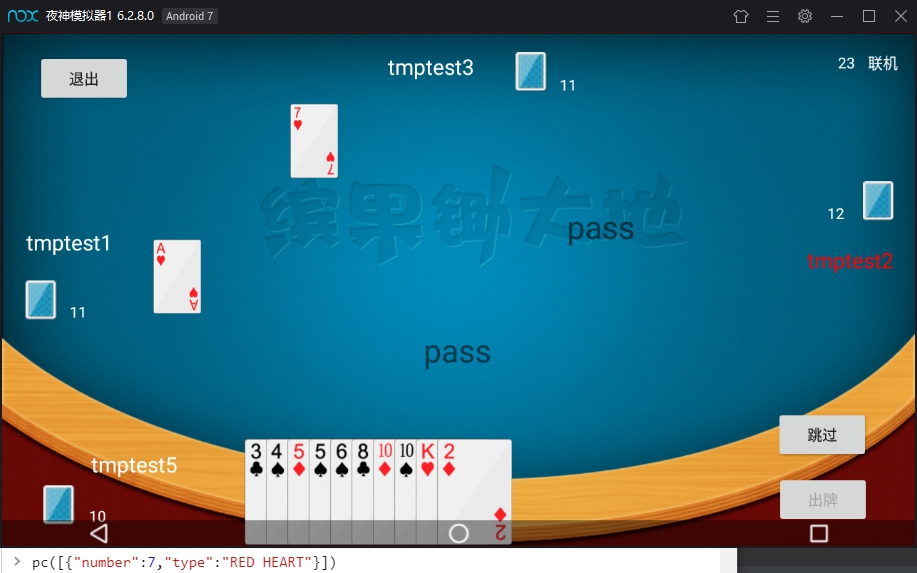
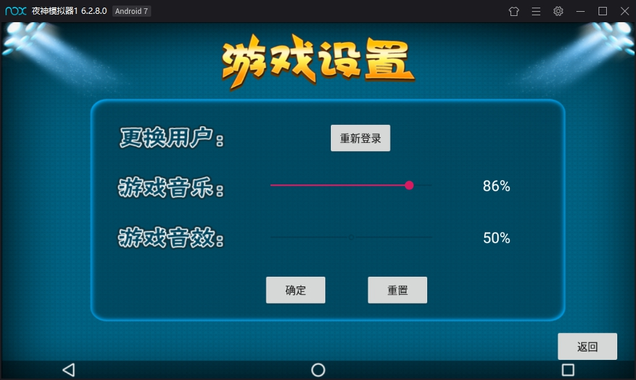
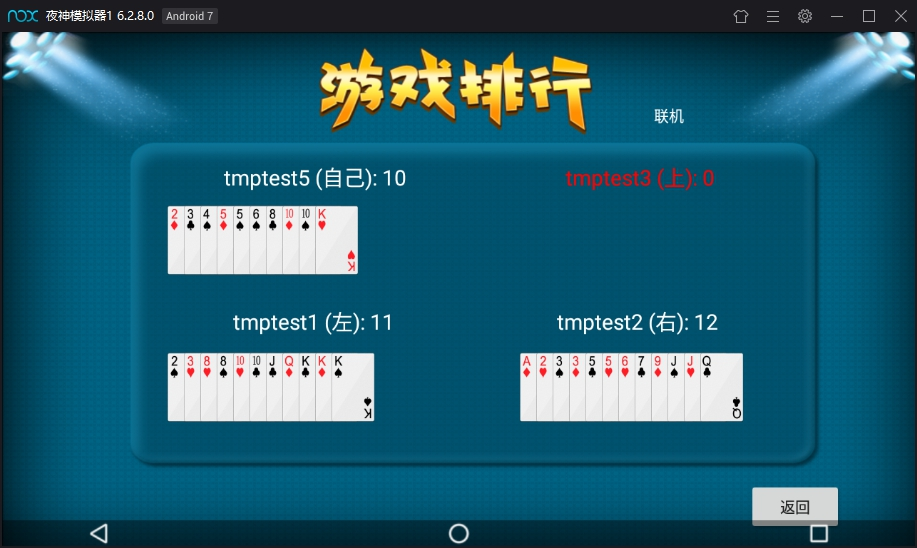

# CDDGame_UML

+ SCUT 2019 OOSAD 课程大作业 及 软件开发综合实训
+ CDDGame At Android MVP Pattern

### Environment
+ `AS` 3.x
+ `gradle` 3.4.1
+ `minSdk` 23 (Android 6)
+ `targetSdk` 28 (Android 9)

### Service
+ Back-End(Express): [CDD-backend](https://github.com/651291702/CDD-backend)

### Main Problem
+ (英文苦手)
+ Online part: 前端与后端交互时 Pass 偶尔检查错误
+ Single part: 机器人出牌算法简陋
+ Other: 一堆垃圾和鸵鸟代码

### References
+ Materials from: [_dis_HLCDD](https://github.com/TianQiLi/_dis_HLCDD)
+ CascadeLayout ref from: [CascadeLayout](https://github.com/CameloeAnthony/CascadeLayout)

### Main ScreenShots

